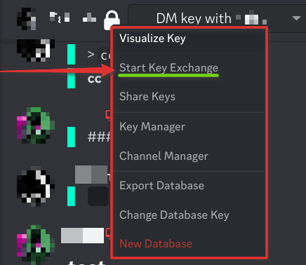
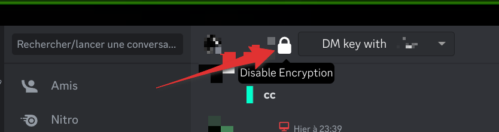

# SimpleDiscordCrypt :
------------
Add this plugin to add an protection to protect your privacy on discord.

## Proof of concept :
------------

## install :
------------
Install BetterDiscord and save this [Plugin](https://raw.githubusercontent.com/s4dic/SimpleDiscordCrypt/main/SimpleDiscordCryptLoader.plugin.js) to your BetterDiscord in `plugins` folder.

## Configure :
------------
* right clic on the padlock and select "Start Key Exchange"

* Now enable encryption

and Enjoy !

### Original Author :
* SimpleDiscordCrypt: [https://gitlab.com/An0/SimpleDiscordCrypt](https://gitlab.com/An0/SimpleDiscordCrypt)

(I have just remove the "SimpleDiscordCrypt" mention, to be more anonymous.)
